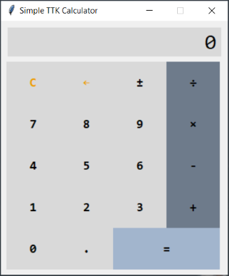

# Simple TTK Calculator
The purpose of this project is purely educational. It aims to show, how
to separate the business logic from the presentation layer using a variation
of the [Model-View-Controller pattern](https://en.wikipedia.org/wiki/Model%E2%80%93view%E2%80%93controller),
in this case with Python and TKInter. Anyone with an interest should feel
free to use it as a basis for their own experiments.

## User Documentation
The TTK Calculator app itself is rather plain and straightforward implementation
of a simple desk calculator.

It's been tested on recent (as of October 2024) versions Windows, macOS
and Ubuntu. For more information about the system requirements, please
see the [Installation](#installation) chapter.



### Features
- Support of integers and decimals with a precision of up to 15 digits
- Addition (`+`), subtraction (`-`), multiplication (`×`) and division (`÷`)
  of two numbers
- Short evaluation (e.g. a sequence of button presses consisting of 
  `9` `×` `=` will be translated to `9` `×` `9` `=`)
- Result of a calculation can be automatically used as the first operand
  of the next calculation (e.g. key sequence `9` `×` `9` `=` `+` `9` `=` 
  will yield `90`)
- Inversion of a sign of the currently displayed number (`±`)
- Correction / removal of last digit of the currently displayed number (`←`)
- Reset of the calculator (e.g. after an error) is done via (`C`) button

### User Interaction
Calculator can be operated by a mouse (left-click on the desired calculator
button) or through a keyboard (see the [user manual](docs/manual.md#key-bindings)
for a complete list of key bindings).

## Installation
Make sure you have [Python 3.12 or newer](https://www.python.org/downloads/) 
installed on your system. Please note that the commands in the next chapters 
use `python` but your system may require you to type `python3` instead.

### For Users
- Choose your **installation folder** and open it in a terminal emulator
(a.k.a. command line) running **cmd**, **powershell**, **bash**, **zsh** or other
**sh**-like shell.
- Clone the GitHub repository
    ```shell
    git clone https://github.com/slacker-by-design/python_etudes
    ```
    If you don't have [git](https://git-scm.com/) installed, go back to the 
    [python_etudes](https://github.com/slacker-by-design/python_etudes) 
    GitHub repository page and download it as a 
    [zip](https://github.com/slacker-by-design/python_etudes/archive/refs/heads/main.zip)
    archive file. Then extract its contents to an installation folder of your choice.
- Run the calculator
    ```shell
    cd python_etudes/ttkcalculator
    python -m ttkcalculator
    ```

### For Developers
- Choose your **installation folder** and clone the
  [GitHub repository](https://github.com/slacker-by-design/python_etudes) into it
- Create a Python virtual environment
    ```shell
    cd ttkcalculator
    python -m venv venv
    ```
- Activate the virtual environment
    - Linux & macOS
      ```shell
      source venv/bin/activate    
      ```
    - Windows Powershell
      ```shell
      .\venv\Scripts\Activate.ps1
      ```
    - Windows CMD
        ```shell
        venv\scripts\activate.bat
        ```
- Install the `ttkcalculator` package as editable
    ```shell
    python -m pip install -e .
    ```

#### Running Tests
- Make sure the `pytest` package is installed in your virtual environment
    The command
    ```shell
    python -m pip list
    ```
    should show a list of installed packages including `ttkcalculator` and `pytest`.
    In case `pytest` is missing, install it by typing
    ```shell
    python -m pip install .[test]
    ```
- Run the tests
    ```shell
    python -m pytest
    ```

## Additional Information
Here's few more bits and pieces, which may be useful...

- You may want to check the [TTK Calculator user manual](docs/manual.md)
- The [technical documentation](docs/technical_specs.md) contains a brief
  explanation of how the Model-View-Controller has been adopted in the
  case of TTK Calculator.

## License
[MIT License](../LICENSE)
